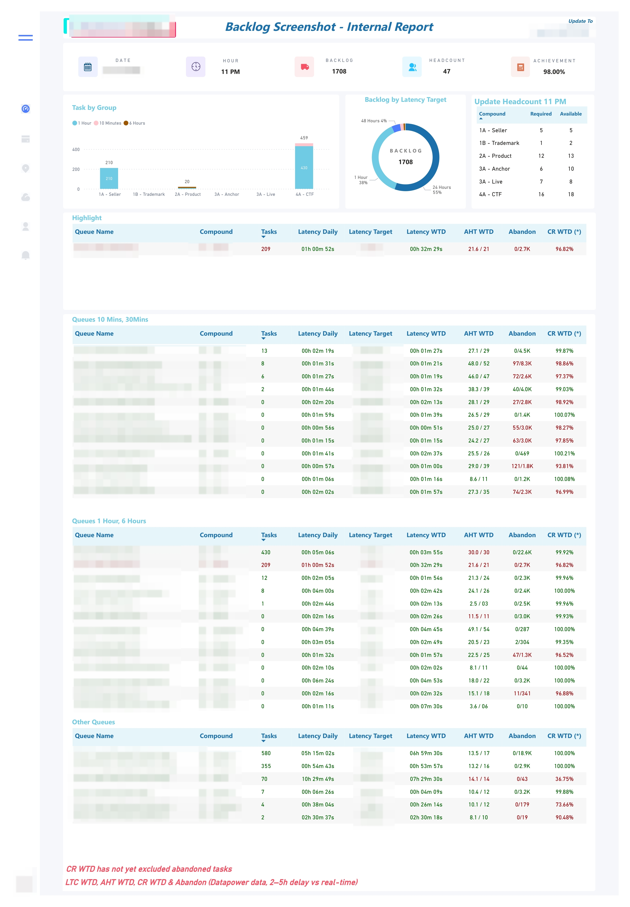

# Hourly Backlog & Workforce Control System

## Business Context
Large-scale operations require timely visibility into backlog and workforce availability to avoid service degradation, especially during demand surges or capacity fluctuations.

Traditional end-of-day reporting is insufficient for real-time operational control, particularly when decisions around staffing, training, and workload redistribution must be made hourly.

---

## Problem Statement
The operation needed a reliable, near real-time view of:

- Current backlog status and latency distribution
- Workforce availability for the upcoming hour
- Short-term staffing requirements to balance productivity and non-productive activities
- Live performance indicators to enable immediate corrective actions

The core challenge was to transform fragmented operational data into a single, automated control view that supports hourly decision-making.

---

## System Design & Approach
The solution integrates three layers:

### 1. Data Ingestion & Automation
- Python-based data crawling from internal systems
- Automated data processing and validation
- SQL storage for historical backlog and performance tracking
- End-to-end automation via a Python bot, including scheduled reporting and stakeholder notifications

### 2. Analytical & Forecasting Logic
- Hourly backlog and latency analysis
- Workforce availability assessment for upcoming hours
- Short-term headcount forecasting based on historical throughput and demand patterns
- Surge detection to trigger early staffing adjustments

### 3. Visualization & Decision Support
- Power BI dashboards for near real-time monitoring
- Clear separation between backlog status, workforce readiness, and performance KPIs
- Hourly reporting to coordination groups to align operations, planning, and leadership

> Due to confidentiality obligations, data sources, logic, and metrics are abstracted and presented at a conceptual level.

---

## Key Decisions Supported
- Allocation of on-product vs non-product activities (training, coaching, breaks)
- Early identification of backlog surges and capacity risks
- Immediate performance intervention during operational hours
- Short-term staffing adjustment and escalation planning

---

## Outcome & Impact
The system enabled operations leaders to move from reactive backlog monitoring to proactive hourly control.

By combining real-time visibility with short-term forecasting, the operation improved responsiveness to demand surges while maintaining workforce efficiency and performance stability.

---

## Core Skills Demonstrated
- Workforce & Capacity Planning
- Real-time Operations Monitoring
- Short-term Forecasting
- Automation & System Thinking
- Stakeholder Decision Support

---
